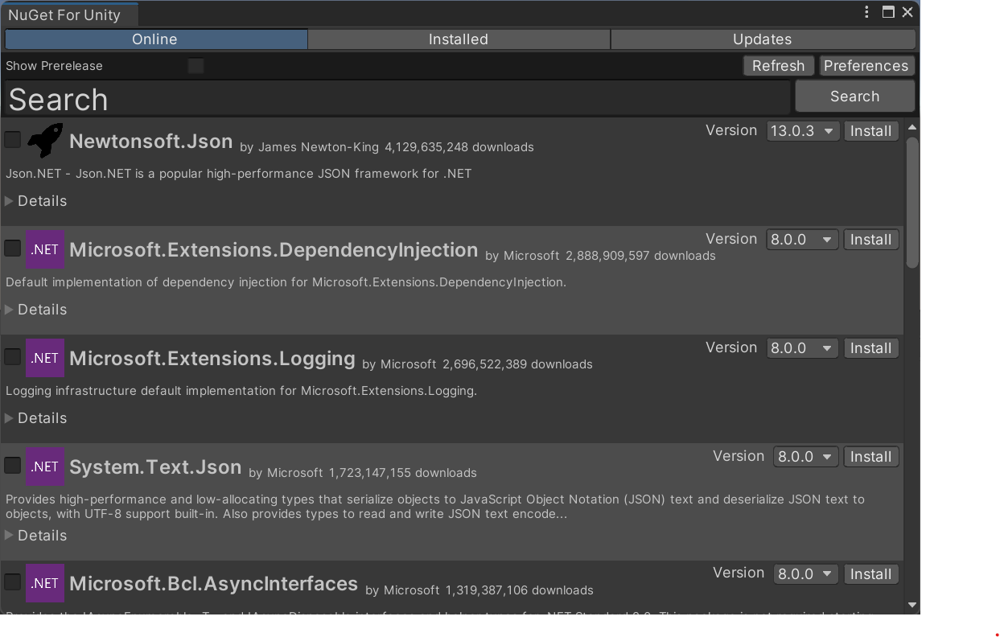
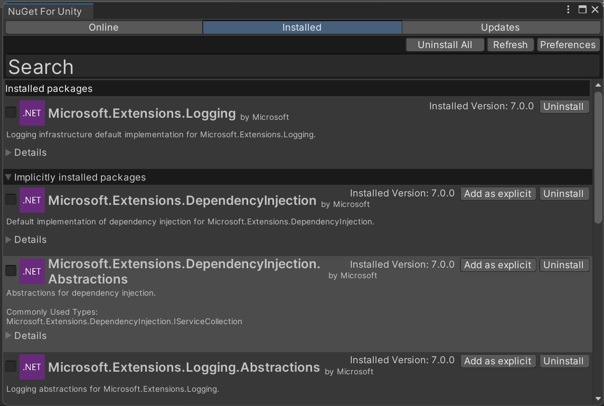

[](https://openupm.com/packages/com.github-glitchenzo.nugetforunity/)  [](LICENSE) [](https://github.com/GlitchEnzo/NuGetForUnity/releases/latest)

# What is NuGetForUnity?

NuGetForUnity is a NuGet client built from scratch to run inside the Unity Editor. NuGet is a package management system which makes it easy to create packages that are distributed on a server and consumed by users. NuGet supports [semantic versioning](http://semver.org/) for packages as well as dependencies on other packages.

You can learn more about NuGet here: [nuget.org](https://www.nuget.org/)

NuGetForUnity provides a visual editor window to see available packages on the server, see installed packages, and see available package updates. A visual interface is also provided to create and edit _.nuspec_ files in order to define and publish your own NuGet packages from within Unity.



# How do I install NuGetForUnity?

<details>
<summary>Install via OpenUPM</summary>
The package is available on the <a href="https://openupm.com/packages/com.github-glitchenzo.nugetforunity/">openupm</a> registry. So you can install it via openupm-cli or manually using a scoped registry see documentation at <a href="https://openupm.com/packages/com.github-glitchenzo.nugetforunity/">openupm</a>.

```
openupm add com.github-glitchenzo.nugetforunity
```

</details>

<details>
<summary>Install as GIT dependency via Package Manager</summary>

#### Unity 2019.3 or newer

1. Open Package Manager window (Window | Package Manager)
1. Click `+` button on the upper-left of a window, and select "Add package from git URL..."
1. Enter the following URL and click `Add` button

```
https://github.com/GlitchEnzo/NuGetForUnity.git?path=/src/NuGetForUnity
```

> **_NOTE:_** To install a concrete version you can specify the version by prepending #v{version} e.g. `#v2.0.0`. For more see [Unity UPM Documentation](https://docs.unity3d.com/Manual/upm-git.html).

#### Unity 2019.2 or earlier

1. Close Unity Editor
1. Open Packages/manifest.json by any Text editor
1. Insert the following line after `"dependencies": {`, and save the file.

    ```json
    "com.glitchenzo.nugetforunity": "https://github.com/GlitchEnzo/NuGetForUnity.git?path=/src/NuGetForUnity",
    ```

1. Reopen Unity project in Unity Editor

</details>

<details>
<summary>Install via .unitypackage file</summary>

Install the provided Unity package into your Unity project. Located [here](https://github.com/GlitchEnzo/NuGetForUnity/releases).

Download the `*.unitypackage` file. Right-click on it in File Explorer and choose "Open in Unity."

</details>

# How do I use NuGetForUnity?

To launch, select **NuGet → Manage NuGet Packages**


After several seconds (it can take some time to query the server for packages), you should see a window like this:


The **Online** tab shows the packages available on the NuGet server.

Enable **Show Prerelease** to list prerelease versions of packages (alpha, beta, release candidate, etc).
Disable **Show Prerelease** to only show stable releases.

Type a search term in the **Search** box to filter what is displayed.

Press the **Refresh** button to refresh the window with the latest query settings. (Useful after pushing a new package to the server and wanting to see it without closing and reopening the window.)

The name of the package, publisher, number of downloads and description are displayed.

Click the **View License** after expanding **Details** to open the license in a web browser.

Click the **Install** to install the package version specified in the dropdown list next to the button.
Note: If the package is already installed, the currently installed version will be displayed in the upper right corner instead.
If the **Install** button is disabled, it means the package is already imported by Unity.

You can also select multiple packages for installation and install them all at once.

In addition to manual selection you can also copy a list of packageIds that you need to install, separated by new line or comma, and simply click the "Select all from clipboard" button at the top right to add them all to the selection.
Note that if the package is already installed or available in Unity it will not show up in the selected list.

The **Installed** tabs shows the packages already installed in the current Unity project.



The **Installed packages** part of the list shows packages directly installed as project dependencies.

The **Implicitly installed packages** part shows packages that are installed as transitive dependencies.

Click the **Uninstall** button to uninstall the package.
When uninstalling an **explicitly** installed package, all of its dependencies that are not a dependency of any other package or the project itself will also be uninstalled.

If **Add as explicit** is clicked on an **implicitly** installed package, it will be moved to the first part of the list and will **not** be automatically uninstalled in a scenario described above.

The **Updates** tab shows the packages currently installed, and offers options to update to available higher versions or downgrade to lower versions.

If **Show Downgrades** is not checked, all packages that have available versions that are higher than the currently installed version will be shown, and there will be a dropdown list next to **Update** button with available versions for update.


The **Update All** button is shown only if **Show Downgrades** is not checked, and it will update all packages with versions currently selected in their respective dropdown lists.

Similarly, if **Show Downgrades** is checked, all packages that have available versions that are lower than the currently installed version will be shown, and there will be a dropdown list next to **Downgrade** button with available versions for downgrade.


By default, the selected version in the dropdown list is the **highest newer** or **highest lower** version, depending on the **Show Downgrades** checkbox.

Click the **Update** (or **Downgrade**) button to uninstall the current package and install the new package.

# Restoring Packages after a Fresh Checkout

When you clone or freshly check out a Unity project that uses NuGetForUnity, you may encounter compiler errors on the first launch. This is because Unity tries to compile your C# scripts before NuGetForUnity has a chance to restore the required NuGet packages defined in the `packages.config` file. As a result, any code that references NuGet packages will fail to compile, and Unity may prompt you with a compile errors popup.

This is a known limitation due to how Unity loads editor plugins and compiles scripts. There are two main ways to avoid or resolve this issue:

## Option 1: Restore Packages Using the CLI (Recommended for CI/CD)

Before opening the project in Unity for the first time, restore all NuGet packages using the NuGetForUnity CLI tool. See the section: [Restoring NuGet Packages over the Command Line](#restoring-nuget-packages-over-the-command-line).

This will download and install all required packages as specified in your `packages.config` before Unity tries to compile your scripts.

## Option 2: Ignore Compile Errors on First Startup (Recommended for Developers)

If you open the project and see compiler errors due to missing NuGet packages:

1. When Unity shows the compile errors popup on startup, select **Ignore** (not Safe Mode).
2. Unity will continue its normal startup and NuGetForUnity will automatically restore the missing packages in the background.
3. Once the restore is complete, Unity will recompile your scripts and the errors should be resolved automatically.

Alternatively, you can trigger a package restore manually via the Unity menu: **NuGet → Restore Packages**.

# How does NuGetForUnity work?

NuGetForUnity loads the _NuGet.config_ file in the Unity project (automatically created if there isn't already one) in order to determine the server it should pull packages down from and push packages up to. By default, this server is set to the `nuget.org` package source.

<details>
<summary>The default NuGet.config file:</summary>

```xml
<?xml version="1.0" encoding="utf-8" ?>
<configuration>
    <packageSources>
        <clear />
        <add key="nuget.org" value="https://api.nuget.org/v3/index.json" />
    </packageSources>
    <activePackageSource>
        <add key="All" value="(Aggregate source)" />
    </activePackageSource>
    <config>
        <add key="repositoryPath" value="./Packages" />
    </config>
</configuration>
```

</details></br>

You can change this to any other NuGet server (such as NuGet.Server or ProGet - see below). The **NuGet → Restore Packages** menu item is useful if you edited the _NuGet.config_ file. See more information about _NuGet.config_ files here: [https://docs.nuget.org/consume/nuget-config-settings](https://docs.nuget.org/consume/nuget-config-settings)

## Directory structure (placement of configuration files and installed packages)

NuGetForUnity supports two different folder structures for defining where the configuration files _NuGet.config_, _packages.config_, and the downloaded `*.dll` files of the NuGet packages are stored. The placement can be changed in the `NuGet For Unity` settings UI.

### Custom within Assets

The _NuGet.config_ file will be placed in `<Unity Project Location>/Assets`, and the placement of the _packages.config_ file and the installed packages can be changed using configuration variables inside the _NuGet.config_ file. The path where NuGetForUnity installs packages, the local repository path, is defined in the _NuGet.config_ file (`repositoryPath`). By default, this is set to the `Assets/Packages` folder. The configured path can either be a full path or a relative path based on the project's Assets folder. Note: You'll probably want your Packages folder to be ignored by your version control software to prevent NuGet packages from being versioned in your repository.

<details>
<summary>Example directory structure:</summary>

```plaintext
<Unity Project Location>
├── Assets
│   ├── NuGet.config
│   ├── packages.config
│   └── Packages
│       └── Serilog.2.12.0
│           ├── icon.png
│           └── lib
│               └── netstandard2.1
│                   └── Serilog.dll
```

</details>

### In Packages folder

All configuration files and the installed packages are placed inside `<Unity Project Location>/Packages/nuget-packages`. This way, the `Assets` directory will not contain any files. In this placement method, the path to the _packages.config_ file and the installed packages directory cannot be changed.

<details>
<summary>Example directory structure:</summary>

```plaintext
<Unity Project Location>
├── Packages
│   └── nuget-packages
│       ├── NuGet.config
│       ├── packages.config
│       └── InstalledPackages
│           └── Serilog.2.12.0
│               ├── icon.png
│               └── lib
│                   └── netstandard2.1
│                       └── Serilog.dll
```

</details>

## Content of _packages.config_ file

When a package is installed, the _packages.config_ file in the project is automatically updated with the specific package information, as well as all of the dependencies that are also installed. This allows for the packages to be restored from scratch at any point. The `Restore` operation is automatically run every time the project is opened or the code is recompiled in the project. It can be run manually by selecting the **NuGet → Restore Packages** menu item.


Note: Depending on the size and number of packages you need to install, the `Restore` operation could take a _long_ time, so please be patient. If it appears the Unity isn't launching or responding, wait a few more minutes before attempting to kill the process.

## Verbose Logging

If you are interested in the process NuGetForUnity follows or you are trying to debug an issue, you can force NuGetForUnity to use verbose logging to output an increased amount of data to the Unity console. Either check the `Use Verbose Logging` checkbox in the `NuGet For Unity` settings window or add the line `<add key="verbose" value="true" />` to the `<config>` element in the _NuGet.config_ file. You can disable verbose logging by either setting the value to false or completely deleting the line.

## Caching

The _.nupkg_ files downloaded from the NuGet server are cached locally in the current user's Application Data folder `%localappdata%\NuGet\Cache` (Windows: `C:\Users\[username]\AppData\Local\NuGet\Cache`, Mac/Linux: `~/.local/share/NuGet/Cache`). The cache location can be overwritten by setting the `NuGetCachePath` environment variable. Packages previously installed are installed via the cache folder instead of downloading it from the server again.

# Advanced settings

## Use custom NuGet server

The default configuration uses `nuget.org` but package sources hosted on other servers should also work. Some need some special settings. The setting can be either set using configuration UI **NuGet → Preferences** or in the _NuGet.config_. Some examples:

### Azure Artifacts / GitHub Packages

They require the `supportsPackageIdSearchFilter` set to `false` e.g.:

```xml
<?xml version="1.0" encoding="utf-8" ?>
<configuration>
    <packageSources>
        <add key="github" value="https://nuget.pkg.github.com/NAMESPACE/index.json" supportsPackageIdSearchFilter="false" />
    </packageSources>
    <packageSourceCredentials>
        <github>
            <add key="userName" value="USERNAME" />
            <add key="clearTextPassword" value="TOKEN" />
        </github>
    </packageSourceCredentials>
    ...
</configuration>
```

### JFrog Artifactory

Requires `protocolVersion` set to `3` the other required settings like `packageDownloadUrlTemplateOverwrite` should be automatically detected / configured.

```xml
<?xml version="1.0" encoding="utf-8" ?>
<configuration>
    <packageSources>
        <add
            key="Artifactory"
            value="https://company.com/artifactory/api/nuget/v3/PROJECT"
            protocolVersion="3"
            packageDownloadUrlTemplateOverwrite="https://company.com/artifactory/api/nuget/v3/PROJECT/registration-semver2/Download/{0}/{1}"
            updateSearchBatchSize="1"
        />
    </packageSources>
    <packageSourceCredentials>
        <Artifactory>
            <add key="userName" value="USERNAME" />
            <add key="clearTextPassword" value="Password" />
        </Artifactory>
    </packageSourceCredentials>
</configuration>
```

### Storing credentials outside of the project `NuGet.config` file

When using a custom NuGet server that requires a `UserName` and a `Password`, you probably wouldn't store it in the `NuGet.config` file that is stored in the Unity Project as it will be committed to source control. Therefore, we support loading the `packageSourceCredentials` section from the system or user-specific `nuget.config` file. The storage location of the system or user-specific `nuget.config` files are documented at [Microsoft's NuGet Configuration](https://learn.microsoft.com/en-us/nuget/consume-packages/configuring-nuget-behavior) (e.g., on Windows `%AppData%\NuGet\NuGet.Config`).

## Disable automatic referencing of assemblies

To disable the automatic referencing of assemblies of a NuGet package you can set the `autoReferenced` attribute of a package inside the `packages.config` to `false`. _Currently this setting is not available from UI._

```xml
<?xml version="1.0" encoding="utf-8" ?>
<packages>
    <package id="Serilog" version="2.12.0" autoReferenced="false" />
</packages>
```

When this setting is set to `false` the assemblies of the NuGet package are only referenced by Unity projects that explicitly list them inside there `*.asmdef` file.

# How do I create my own NuGet packages from within Unity?

First, you'll need to create a _.nuspec_ file that defines your package. In your Project window, right click where you want the _.nuspec_ file to go and select **NuGet → Create Nuspec File**.


Select the new _.nuspec_ file and you should see something like this:


Input the appropriate information for your package (ID, Version, Author, Description, etc). Be sure to include whatever dependencies are required by your package.

Press the **Pack** button to pack your package into a _.nupkg_ file that is saved in the `C:\Users\[username]\AppData\Local\NuGet\Cache` folder.

Press the **Push** button to push your package up to the server. Be sure to set the correct API Key that give you permission to push to the server (if you server is configured to use one).

# How do I create my own NuGet server to host NuGet packages?

You can use [NuGet.Server](http://nugetserver.net/), [NuGet Gallery](https://github.com/NuGet/NuGetGallery), [ProGet](http://inedo.com/proget), etc to create your own NuGet server.

> **Note:** NuGetForUnity doesn't use the official NuGet Client implementation form Microsoft, so authenticating against a third-party NuGet server is currently not supported for every case. If you ran into authentication issues please create a issue so we can try to implement it.

Alternatively, you can use a "local feed" which is just a folder on your hard-drive or a network share. [Local NuGet feeds](https://learn.microsoft.com/en-us/nuget/hosting-packages/local-feeds) can have two different structures:

- flat: &lt;local feed path&gt;/&lt;package id&gt;.&lt;package version&gt;.nupkg
- hierarchical: &lt;local feed path&gt;/&lt;package id&gt;/&lt;package version&gt;/&lt;package id&gt;.&lt;package version&gt;.nupkg

Be sure to set the proper URL/path in the _NuGet.config_ file and you should be good to go!

Read more information here: [http://docs.nuget.org/create/hosting-your-own-nuget-feeds](http://docs.nuget.org/create/hosting-your-own-nuget-feeds)

# Restoring NuGet Packages over the Command Line

For those with projects using automated build solutions like [continuous integration](https://en.wikipedia.org/wiki/Continuous_integration), NuGetForUnity provides the ability to restore your NuGet packages directly from the command line without starting Unity. This is achieved using a separate [NuGetForUnity.Cli](https://www.nuget.org/packages/NuGetForUnity.Cli) NuGet package containing a [.Net Tool](https://learn.microsoft.com/en-us/dotnet/core/tools/global-tools).

## Installation

- System-wide as a global tool using: `dotnet tool install --global NuGetForUnity.Cli`.
- Project / folder wide as a local tool using: A tool manifest (local tool installation context) can be created with: `dotnet new tool-manifest`. Than install NuGetForUnity.Cli using: `dotnet tool install NuGetForUnity.Cli`. Than add the tool manifest `.config/dotnet-tools.json` to your version control system.

For more information see [.Net Tool Documentation](https://learn.microsoft.com/en-us/dotnet/core/tools/global-tools).

## Usage

Restore nuget packages of a single Unity Project: `dotnet nugetforunity restore <PROJECT_PATH>`. If installed as a global tool it can be called without the `dotnet` prefix: `nugetforunity restore <PROJECT_PATH>`.

# Plugin support

NugetForUnity has plugin support. If you open the NugetForUnity section in Unity preferences it will list the plugins you have installed in your project and you can enable them from there.

Plugins are any dlls which contain NugetForUnityPlugin in their name and have a class inside them that implements the `INugetPlugin` interface. They can be placed anywhere inside the project (inside the `Assets` directory).

If you are interested in implementing a plugin read the [plugin development documentation](plugin-dev-readme.md).

# Common issues when installing NuGet packages

In the .Net ecosystem Unity is relatively special as it doesn't use the standard .Net runtime from Microsoft instead, it uses a fork of the [Mono](https://docs.unity3d.com/Manual/Mono.html) runtime. For some platforms Unity even uses [IL2CPP](https://docs.unity3d.com/Manual/IL2CPP.html) that compiles all C# code to C++ code. So Unity also uses a different build-system. This can lead to some issues with NuGet packages that heavily depend on the standard .Net build-system. NuGetForUnity tries to handle most of the changes needed to allow using NuGet packages inside Unity but it is not able to resolve all issues. This section contains some common issues and potential solutions.

## Version Conflicts

If two NuGet packages depend on the same package but reference different versions of it, Unity shows an error like:

```
Assembly 'Assets/Packages/System.Diagnostics.EventLog.4.7.0/lib/netstandard2.0/System.Diagnostics.EventLog.dll' will not be loaded due to errors:
System.Diagnostics.EventLog references strong named System.Security.Principal.Windows Assembly references: 4.1.1.0 Found in project: 4.1.3.0.
Assembly Version Validation can be disabled in Player Settings "Assembly Version Validation"
```

As mentioned in the message this error can be suppressed by changing a setting. Just go to Edit -> Project Settings -> Player -> Scroll down and expand "Other Settings" than uncheck "Assembly Version Validation" under the "Configuration" section.

<details>
<summary>Screenshot of Player Settings</summary>

</details>

## Missing System libraries

When targeting .Net Framework, the 'Api Compatibility Level' setting under _Edit_ -> _Project Settings_ -> _Player_ -> _Other Settings_ is set to .NET Framework, Unity doesn't include some System libraries by default. See also [Unity documentation about system libraries](https://docs.unity3d.com/Manual/dotnetProfileAssemblies.html) and [Unity documentation about .Net Profiles](https://docs.unity3d.com/Manual/dotnetProfileSupport.html). Libraries that are not imported by default are e.g. `System.Drawing`, `System.IO.Compression`, `System.IO.Compression.FileSystem` and `System.Net.Http`. If you try to use one of this libraries you get an error like:

```
The type `HttpClient` is defined in an assembly that is not referenced. You must add a reference to assembly 'System.Net.Http, Version=4.0.0.0, Culture=neutral, PublicKeyToken=b03f5f7f11d50a3a'.
```

To import one of the System libraries and resolve the error you need to create a `csc.rsp` file with the content e.g. to import `System.Net.Http`

```
-r:System.Net.Http.dll
```

and place it inside the containing project that requires the library (e.g. the `Assets` folder). It can also be placed in a folder that contains a `.asmdef` to only add the reference to the sub-project. For example NuGetForUnity also uses a `csc.rsp` file see [csc.rsp](src/NuGetForUnity/Editor/csc.rsp).
